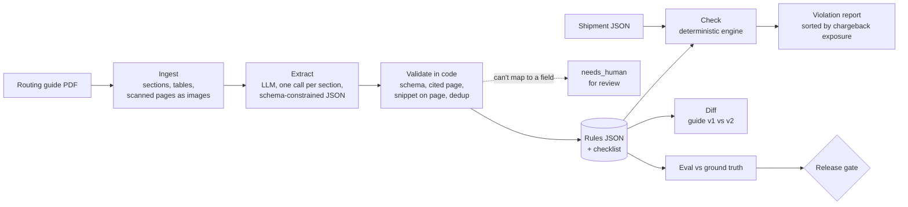

# Coreframe Comply

Turn retailer routing guides into cited, checkable rules, and catch chargebacks before a shipment leaves the dock.

## The problem

Retailers publish vendor routing guides: long PDFs of shipping rules covering carton limits, label placement, advance ship notice (ASN) timing, approved carriers and delivery appointments. Break a rule and the retailer deducts a chargeback from the invoice. A mid-market 3PL ships to dozens of retailers, each with its own guide, and the guides change every year. The rules that cost money are buried in tables, appendices and cross-references, and the people packing the truck never read page 40.

## Design principle: the LLM extracts, code checks

- A model reads the guide and extracts typed rules, each with a page, a section and a verbatim quote.
- **Deterministic code decides whether a shipment passes.** The model never makes a pass/fail call.
- A rule counts as checkable only if every parameter maps to a field in a fixed registry of shipment fields. The model's output is constrained to that registry while it generates, so it can't invent a field. Anything else is marked `needs_human` and shown to a person.
- Code, not the model, verifies that each quoted snippet really appears on the cited page.
- Releases are gated on an eval against hand-labeled ground truth.

## Pipeline



## Quick start

```bash
python3.11 -m venv .venv && .venv/bin/pip install -e ".[dev]"
.venv/bin/pytest -q
```

Everything below runs on the bundled synthetic guide. Only `extract` needs an API key, and only on its first run.

### 1. Extract rules from a guide

```bash
export ANTHROPIC_API_KEY=...
.venv/bin/python -m coreframe extract --guide data/sample/guides/northwind/v2025.1.pdf
```

Writes `rules/<retailer>_<version>.json` and a checklist (markdown plus a self-contained HTML page) grouped by category, with page and section citations on every rule. Each raw model response is cached on disk, keyed by guide hash, prompt version, model and section, so reruns and evals are free. `--offline` replays from the cache. If the prompt changes without a version bump, the run stops instead of replaying stale answers. Tokens, cost and latency are logged per call under `runs/`.

Flags: `--model` (default `claude-sonnet-5`, or set `COREFRAME_MODEL`), `--effort`, `--prompt` (versioned files in `prompts/`).

### 2. Check a shipment

```bash
.venv/bin/python -m coreframe check \
    --rules data/sample/rules/northwind_v2025.1.reference.json \
    --shipment data/sample/shipments/demo-ltl-6012.json
```

Each violation shows expected vs. actual, the failing carton or pallet, the citation and the estimated chargeback, sorted by exposure. Exit code is 1 if anything fails, so it can gate a WMS step. See [the demo report](data/sample/reports/DEMO-LTL-6012.check.md).

- Units are converted (a rule in cm is checked against inch fields).
- Missing data is flagged for review and never silently passed.
- Each chargeback-schedule line is billed once, even when several rules map to it.

### 3. Diff two guide versions

```bash
.venv/bin/python -m coreframe diff \
    --old data/sample/rules/northwind_v2025.1.reference.json \
    --new data/sample/rules/northwind_v2025.2.reference.json
```

Reports added, removed and changed rules, with old and new values side by side, citations to both versions, and a stricter/looser label. A renumbered section or a reworded sentence with the same limits is reported as unchanged. See [the sample diff](data/sample/reports/diff_northwind_v2025.1_v2025.2.md).

### 4. Evaluate and gate a release

```bash
.venv/bin/python eval.py --propose     # propose rule matches for a person to confirm
# review data/.../eval/<guide>.matches.csv: set confirmed to y or n, fix or add rows
.venv/bin/python eval.py               # score, write eval_report.md, exit nonzero if a threshold is missed
make release VERSION=0.1.0             # tests + eval gate on a clean tree, then tag
```

## Eval

The eval compares extracted rules to hand-labeled ground truth (`data/ground_truth/<retailer>_<version>.csv`).

- **Rule precision and recall.** A matcher proposes which extracted rule states each ground-truth rule and writes the proposals to a CSV. **Only matches a person has confirmed are counted.** If a later extraction changes a rule, its confirmation goes stale and has to be redone.
- **Parameter accuracy.** On matched rules, value and unit must both be right.
- **Citation accuracy.** The cited page must be right.
- **Checker eval.** Synthetic shipments with seeded violations measure catch rate, false-positive rate and needs-review rate. When a hand-written reference rule set exists, the violation labels come from it and the shipments are checked with the *extracted* rules, so an extraction miss lowers the catch rate.
- **Failure analysis.** Every miss lands in a CSV with a column to tag the cause: table parsing, cross-reference between sections, conditional rule, ambiguous wording, model reasoning error, or other.
- **Gate.** `eval_config.yaml` holds the thresholds. A metric that could not be measured fails the gate. CI re-derives the rules from the cached model responses on every push and re-scores them.

### Results

| Metric | Result | Threshold (placeholder) |
|---|---|---|
| Rule recall | not yet measured | ≥ 85% |
| Rule precision | not yet measured | ≥ 90% |
| Parameter accuracy | not yet measured | ≥ 90% |
| Citation accuracy | not yet measured | none set |
| Violation catch rate | not yet measured | ≥ 95% |

No live extraction has been run yet, so there are no results to report. The eval code itself is tested against a simulated extraction with planted errors (see `tests/test_evaluate.py`). This table will be filled from `eval_report.md` after the first real run.

## Data

`data/sample/` is a **synthetic** guide for a fictional retailer (Northwind Retail Co.) in two versions, with hand-written ground truth and reference rule sets. `scripts/build_sample_guide.py` generates it. It is built to include the hard cases:

- rules that appear only in tables, including a table split across pages
- conditional rules (parcel only, one DC only)
- cross-references (fees in a schedule table that point back to other sections)
- a scanned page with no text layer
- rules that cannot be auto-checked
- a glossary that should not become rules

Everything else under `data/` (real retailer guides, ground truth, caches, outputs) is gitignored and never leaves your machine.

## Repo layout

```
coreframe/     ingest, chunking, extract, llm (cache + cost log), engine, synth, diff, evaluate, render
prompts/       versioned prompt files (the version is part of the cache key)
data/          gitignored, except data/sample/
scripts/       sample guide and reference rule builders
tests/         schemas, ingestion, extraction (stubbed client), rule engine, diff matching, eval
eval.py        eval + release gate          eval_config.yaml   thresholds
```

## Known limitations

- **Ingestion** assumes a single text column, detects only tables drawn with ruling lines, and needs numbered headings ("4.2", "Section 4", "Appendix B"). Guides with unnumbered headings or borderless tables will chunk badly.
- **The shipment schema is small.** Rules about fields it doesn't record (burst strength, arrival time, routing-request dates, origin country) can only be surfaced for review. On the sample, over a third of applicable rule checks come back as needs-review.
- **Operators are limited** to eq, lte, gte, between, in, before and exists. "Within 60 minutes after tender", day-of-week windows and counts ("two labels on adjacent sides") can't be expressed yet.
- **String values aren't mapped to a vocabulary.** "BOL" and "Bill of Lading" won't match. Real WMS data needs an alias table per customer.
- **Chargeback exposure is an estimate.** It can't price percent-of-invoice fees, and it assumes rules with identical fee text share one schedule line.
- **Version diff** matches greedily within a category. A rule that changes category between versions shows as removed plus added.
- **The synthetic guide is short and clean** compared with real guides. Results on it say little about a 120-page scanned PDF.
- **Thresholds are placeholders** until there are real results to calibrate against.

## What v1 would add

- **EDI 856 ASN ingestion**, so ASN content rules (SSCC matching, carton counts) can be checked instead of flagged.
- **WMS export connectors** with per-customer field mapping, unit conversion and value aliases.
- **Automatic re-extraction when a guide changes**: watch for a new version, extract, diff, and send the ops lead only what got stricter.
- A review workflow where a person approves `needs_human` and low-confidence rules before they go live.
- Grounded Q&A over a guide ("what's the max pallet height for DC 6012?") with citations and refusals.
